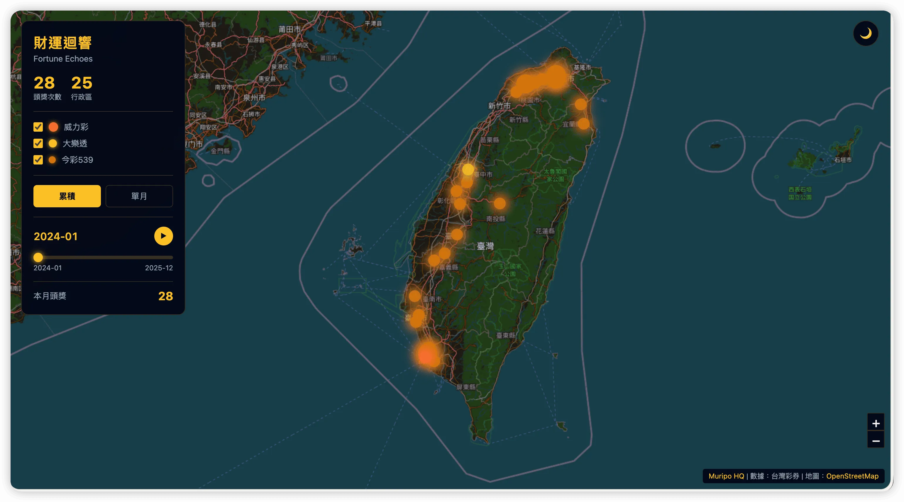

# Fortune Echoes 財運迴響

[](https://creativecommons.org/licenses/by-nc-sa/4.0/)
[](https://leafletjs.com/)
[](https://d3js.org/)
[](https://maps.nlsc.gov.tw/)

[← 回到 Muripo HQ](https://tznthou.github.io/muripo-hq/) | [English](README_EN.md)

一個將台灣彩券頭獎開出地點視覺化的互動地圖。金色的能量光球標記每個中獎行政區，當時間軸推進，漣漪從新的中獎點擴散開來，像是財運的波動在島嶼上迴盪。



> **"每一次開獎，都是一道財運的漣漪。"**

---

## 核心概念

這不是一張靜態的統計圖表，而是一個**時間維度的視覺敘事**。

從 2024 年 1 月到 2025 年 12 月，24 個月份，778 次頭獎開出。每個行政區的能量光球大小代表累積的中獎次數，而漣漪則呈現當月的新增中獎——你看見的不只是「哪裡中獎」，而是「財運如何在這片土地上流動」。

---

## 功能特色

| 功能 | 說明 |
|------|------|
| **時間軸播放** | 24 個月份自動播放，觀察中獎熱點的變化 |
| **累積/單月模式** | 切換顯示累積統計或當月快照 |
| **彩種篩選** | 獨立顯示威力彩、大樂透、今彩539 |
| **深淺主題** | 支援深色與淺色地圖風格 |
| **懸停資訊** | 顯示行政區詳細中獎紀錄 |

---

## 資料來源

### 彩券資料

- **來源**：台灣彩券官方網站
- **範圍**：2024/01 - 2025/12（24 個月）
- **彩種**：威力彩、大樂透、今彩539
- **筆數**：778 筆頭獎紀錄
- **涵蓋**：207 個行政區

### 地圖資料

- **底圖**：[國土測繪中心 NLSC](https://maps.nlsc.gov.tw/) 通用電子地圖（繁體中文，無商用限制）
- **行政區座標**：基於 [taiwan-atlas](https://github.com/dkaoster/taiwan-atlas) TopoJSON 計算各區中心點

---

## 視覺設計

### 能量光球

光球大小與顏色反映中獎次數與彩種：

| 彩種 | 色彩 | 光暈 |
|------|------|------|
| **威力彩** | 烈焰橙 `#ff6b35` | 最大光暈（獎金最高） |
| **大樂透** | 金黃 `#fbbf24` | 中等光暈 |
| **今彩539** | 琥珀 `#d97706` | 標準光暈 |

### 漣漪動畫

當月新增的中獎點會產生向外擴散的同心圓漣漪，視覺化「財運的波動」：

```
     ○ ○ ○
   ○ ○ ● ○ ○    ← 新增中獎點
     ○ ○ ○         產生漣漪
       ↓
    擴散消散
```

### 主題切換

- **深色模式**：適合夜間瀏覽，CSS Filter 反轉 NLSC 圖磚
- **淺色模式**：原始 NLSC 圖磚，清晰可讀

---

## 技術架構

### 前端技術棧

| 技術 | 用途 | 備註 |
|------|------|------|
| [Leaflet.js](https://leafletjs.com/) | 地圖渲染 | 限制台灣區域，7-16 縮放層級 |
| [D3.js](https://d3js.org/) | SVG 視覺化 | 能量光球 + 漣漪動畫 |
| [NLSC](https://maps.nlsc.gov.tw/) | 底圖圖磚 | 國土測繪中心，繁體中文 |
| Vanilla JS | 無框架 | 模組化設計 |

### 資料處理流程

```
┌─────────────────────────────────────────────────────┐
│              Data Processing Pipeline               │
├─────────────────────────────────────────────────────┤
│                                                     │
│  ┌──────────┐    ┌──────────────┐    ┌──────────┐  │
│  │ CSV 原始 │ →  │ 地址解析匹配 │ →  │ JSON     │  │
│  │ 彩券資料 │    │ 行政區座標   │    │ 視覺資料 │  │
│  └──────────┘    └──────────────┘    └──────────┘  │
│                                                     │
│  taiwan-atlas TopoJSON → 368 行政區中心點座標       │
│                                                     │
└─────────────────────────────────────────────────────┘
```

### 模組結構

| 模組 | 職責 |
|------|------|
| `data.js` | 載入 JSON、按月份/累積查詢 |
| `map.js` | Leaflet 地圖初始化、主題切換 |
| `ripple.js` | D3 SVG overlay、光球與漣漪繪製 |
| `timeline.js` | 時間軸控制、自動播放 |
| `app.js` | 主入口、狀態管理、事件綁定 |

---

## 程式碼審查

本專案經過完整的程式碼審查，修復了所有 Critical 與 High 優先級問題：

### 已修復 ✅

| ID | 類別 | 問題 | 修復方式 |
|----|------|------|----------|
| C01 | Critical | CSP 安全策略 | 加入 Content-Security-Policy meta tag |
| C02 | Critical | D3.js SRI 完整性 | 加入 integrity 與 crossorigin 屬性 |
| H01 | High | 錯誤邊界處理 | 加入 try/catch 與使用者友善錯誤訊息 |
| H02 | High | 事件監聽器記憶體洩漏 | 儲存 handler 參照，新增 destroy() 方法 |
| H03 | High | 動畫時序衝突 | 加入 animation lock 防止重疊 |
| H04 | High | 無障礙設計 | 加入 ARIA 屬性、鍵盤導航、焦點樣式 |
| H05 | High | 時間軸無障礙 | 加入 aria-valuetext 供螢幕閱讀器使用 |
| H06 | High | XSS 防護 | 新增 escapeHtml() 處理使用者資料 |
| H07 | High | 資料驗證 | 座標邊界檢查、格式驗證 |
| M01 | Medium | D3 transition 清理 | 使用 .interrupt() 中斷舊動畫 |
| M02 | Medium | 視口剔除 | 只渲染可見區域的元素 |
| M06 | Medium | 動態時間軸標籤 | 根據資料動態更新起訖日期 |
| M07 | Medium | 主題持久化 | 使用 localStorage 記憶偏好 |
| M08 | Medium | 載入狀態 | 加入 loading overlay 與 spinner |
| M09 | Medium | 圖磚政策 | 改用 NLSC 國土測繪中心圖磚 |

### 延後處理（低影響）

| ID | 問題 | 理由 |
|----|------|------|
| M03 | console.log 移除 | 開發除錯用，production build 可 strip |
| M04 | Magic numbers | 可讀性優化，不影響功能 |
| M05 | Map bounds 常數 | 已在 data.js 定義，重複但不影響 |
| M10 | renderMonth 拆分 | 重構類，不影響功能 |
| L01-L09 | 各種 Low | 優先級最低，可選優化 |

---

## 專案結構

```
day-27-fortune-echoes/
├── index.html
├── static/
│   ├── css/
│   │   └── style.css              # 深色主題 + 控制面板
│   └── js/
│       ├── data.js                # 資料模組
│       ├── map.js                 # Leaflet 地圖
│       ├── ripple.js              # D3 漣漪視覺
│       ├── timeline.js            # 時間軸控制
│       └── app.js                 # 主入口
├── data/
│   ├── fortune.json               # 處理後的中獎資料
│   └── taiwan_districts.json      # 行政區中心座標
├── assets/
│   └── preview.webp               # 預覽圖
├── package.json
├── LICENSE
├── README.md
└── README_EN.md
```

---

## 本地開發

```bash
# 複製專案
git clone https://github.com/tznthou/day-27-fortune-echoes.git
cd day-27-fortune-echoes

# 安裝依賴（僅開發伺服器）
npm install

# 啟動開發伺服器
npm run dev

# 開啟瀏覽器
open http://localhost:3000
```

---

## 隨想

### 為什麼是「迴響」？

中獎這件事，就像在平靜的水面投入一顆石子。

漣漪會向外擴散，然後消散。但水面記得那個波動。累積模式下的光球，就是這片水面的記憶——它記得每一次的財運降臨，即使漣漪早已遠去。

### 關於行政區

我們刻意不使用精確的店家地址，而是用行政區中心點。

這不是技術限制，而是設計選擇。當你看見一個行政區的光球變大，你感受到的是「這一帶的財運密度」，而不是「某間彩券行特別靈」。這是一個關於地理分佈的故事，不是一張尋寶圖。

### 數據的溫度

778 筆頭獎紀錄，每一筆背後都是一個人的人生轉折。

有人可能還清了房貸，有人可能開始了新事業，有人可能只是買了一張彩券就忘了。我們無法知道這些故事，但當光球亮起、漣漪擴散，這些數字有了一點點溫度。

這就是資料視覺化的意義——讓冰冷的數據開始說話。

### 財運的地理學

財運是否固定在某些地方？還是它只是剛好在那裡發生？

看著地圖上的光球，你會發現有些行政區特別亮眼，有些則從未亮起。那些從未中過獎的地方，是否明天就會迎來第一道光？那些你常去的地方，是否某天某月，就這樣等著等著，財運就降臨了？

沒有人能給你確切答案。

但這正是這張地圖有趣的地方——它記錄的是過去，不是未來。當你看著時間軸推進，看著漣漪在島嶼上此起彼落，你會發現一件事：財運從不按牌理出牌。它在你意想不到的時間、意想不到的地點，悄悄降臨。

也許，直接看著地圖，會比任何分析都更接近答案。

---

## 授權

本作品採用 [CC BY-NC-SA 4.0](https://creativecommons.org/licenses/by-nc-sa/4.0/) 授權。

這意味著：
- ✅ 可自由分享與改作
- ✅ 需標示原作者
- ❌ 禁止商業使用
- 🔄 衍生作品需採用相同授權

---

## 相關專案

- [Day-23 City Breath](https://github.com/tznthou/day-23-city-breath) - 空氣品質視覺化
- [Day-24 Topography of Care](https://github.com/tznthou/day-24-topography-of-care) - 社福資源等高線
- [Day-25 Data Tapestry](https://github.com/tznthou/day-25-data-tapestry) - GitHub Trending 織錦

---

> **"財運的軌跡，不是預測未來，而是看見過去的波動。"**
